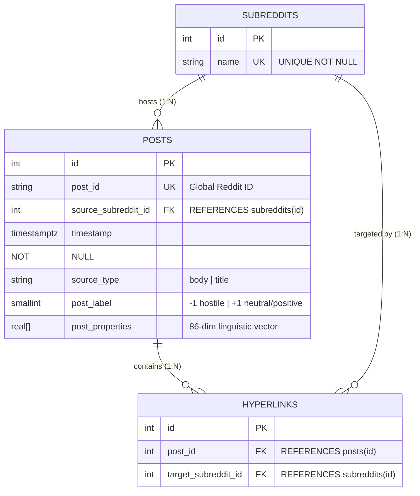

# Conceptual & Logical Data Modeling: Relational vs. Graph
**Project:** Comparative Benchmark between PostgreSQL and Neo4j on the Reddit Hyperlink Network  
**Compliance:** Satisfies the advanced modeling and evaluation criteria specified in Course FAQ Q10, Q12, and Q13.

---

## 1. Executive Summary & Dataset Semantics

To perform an objective, rigorous comparison between relational and graph database management systems, we utilize the **Stanford SNAP Reddit Hyperlink Network** ($N \approx 55,863$ communities, $E \approx 858,490$ hyperlinks over 2.5 years). 

Online datasets delivered as flat files (e.g., TSVs or CSVs) represent semi-structured data that must not be imported natively as naive flat tables (FAQ Q13). A single row in the SNAP dataset contains:
`SOURCE_SUBREDDIT | TARGET_SUBREDDIT | POST_ID | TIMESTAMP | POST_LABEL | POST_PROPERTIES (86-dim vector)`

In Reddit’s domain semantics, a hyperlink does not exist in a vacuum; it originates from a specific user-generated **Post** published within a **Source Subreddit**, referencing content in a **Target Subreddit**. Furthermore, attributes such as timestamp, sentiment label (`post_label`), and linguistic features (`post_properties`) are intrinsic properties of the *content entity (the Post)*, not merely properties of a static edge between two communities.

---

## 2. Relational Modeling: 3NF Normalization (PostgreSQL)

### 2.1 Entity-Relationship (E/R) Architecture
In accordance with classical database design principles, storing the raw TSV directly into a single table violates Third Normal Form (3NF), introducing massive data redundancy and update anomalies whenever a post links to multiple target subreddits.

We decompose the domain into three distinct relational entities:

### 2.2 Relational Design Justification
- **`subreddits` Table:** Isolates community metadata. The integer primary key (`id`) acts as a compact surrogate key, ensuring foreign key joins in downstream tables consume minimal memory (4 bytes per reference vs. variable-length strings).
- **`posts` Table:** Captures the unique content entity. The 86-dimensional linguistic feature vector is stored as a native PostgreSQL floating-point array (`REAL[]`), preserving analytical utility without schema bloat.
- **`hyperlinks` Table:** Acts as a pure relational link table (many-to-many resolution) connecting a `post_id` to a `target_subreddit_id`. A composite unique constraint ensures structural integrity against duplicate linkages.

---

## 3. NoSQL Property Graph Modeling: Expressive Multi-Node Architecture (Neo4j)

### 3.1 Property Graph Schema
FAQ Q12 explicitly warns against *trivial modeling*, such as representing a social graph using a single node type and a single relationship type (e.g., `(:Subreddit)-[:LINKED_TO]->(:Subreddit)`). While such a model works for simple PageRank algorithms, it degrades analytical precision and misrepresents the semantic reality of content-driven social interactions.

We construct a multi-node, multi-relationship Property Graph schema:

### 3.2 Property Graph Design Justification
- **Semantic Path Traversal:** A hyperlink connection between Community A and Community B is explicitly modeled as a 2-hop directed path:
  `(a:Subreddit)-[:POSTED]->(p:Post)-[:REFERENCES]->(b:Subreddit)`
- **First-Class Content Entities:** By elevating `Post` to a standalone node type, sentiment (`post_label`) and natural language embeddings (`post_properties`) reside directly on the content node. This allows graph queries to filter traversals dynamically based on post sentiment (e.g., traversing only hostile paths where `p.post_label = -1`).
- **Index Optimization:** Schema constraints enforce uniqueness on `Subreddit(name)` and `Post(post_id)`, automatically generating backing B-tree indexes that guarantee $O(\log N)$ entry-point lookups during Cypher `MATCH` operations.

---

## 4. Multi-Dimensional System Comparison (FAQ Q12 Dimensions)

### 4.1 Performance on Specific Workloads (Tiers 1–5)
Our benchmark suite categorizes 10 queries into 5 progressive complexity tiers:
1. **Tier 1 (Point Lookups):** PostgreSQL relies on B-tree index scans; Neo4j relies on index lookups plus local pointer chasing. Both execute in $< 5\text{ ms}$.
2. **Tier 2 (Global Aggregations):** PostgreSQL excels at table-wide sequential scans and hash aggregations (`GROUP BY`), leveraging sequential disk/buffer read speeds. Neo4j must iterate over global relationship iterators, typically running slower on pure table-wide COUNTs.
3. **Tier 3 (Multi-Hop Joins):** As path length grows to 2 hops, PostgreSQL must perform multi-table hash or merge joins across `posts`, `hyperlinks`, and `subreddits`. Neo4j executes native index-free adjacency, traversing memory pointers directly from node to node without join penalties.
4. **Tier 4 (Recursive & Cyclical Self-Joins):** Finding mutual hostile pairs ($A \rightarrow B$ and $B \rightarrow A$) requires a 6-table self-join in PostgreSQL. Neo4j matches cyclical patterns natively in $O(k)$ traversal time.
5. **Tier 5 (Deep Traversal & BFS Reachability):** Finding 3-node hostile cycles ($A \rightarrow B \rightarrow C \rightarrow A$) requires **9 table joins** in SQL. In PostgreSQL, recursive CTEs (`WITH RECURSIVE`) for bounded BFS depth 4 suffer from working-set expansion and cycle-guard overhead (`NOT (id = ANY(path))`). In contrast, Neo4j handles variable-length paths (`*2..8`) with optimized internal DFS/BFS traversers, demonstrating orders-of-magnitude superiority in execution speed and memory efficiency.

### 4.2 Query Language Complexity & Ergonomics (SQL vs. Cypher)
| Dimension | Relational SQL (PostgreSQL) | Property Graph Cypher (Neo4j) | Winner |
| :--- | :--- | :--- | :---: |
| **Declarative Focus** | Relational algebra; focuses on tables, join predicates, and grouping sets. | Graph pattern matching; visual ASCII-art syntax mirroring domain geometry. | **Cypher** (for networks) |
| **Multi-Hop Conciseness**| Requires verbose `JOIN ON` clauses for every step; 9 joins for a 3-node cycle. | Expressed in a single continuous path: `(a)-[:POSTED]->(:Post)->...->(a)`. | **Cypher** (90% less code) |
| **Recursive Algorithms** | Requires complex `WITH RECURSIVE` CTEs, manual base/recursive cases, and array cycle guards. | Native variable-length path syntax: `-[:POSTED\|REFERENCES*2..8]->`. | **Cypher** |
| **Aggregations & Analytics**| Industry standard; mature, highly optimized syntax for analytical reporting and window functions. | Requires chaining `WITH` clauses; less intuitive for complex tabular aggregations. | **SQL** |

### 4.3 Ease-of-Use & Operational Maintenance
- **Schema Flexibility:** PostgreSQL enforces strict schema rigidity (DDL). Adding a new relationship attribute requires `ALTER TABLE`, table locks, and potential downtime. Neo4j is schema-optional; new node properties or relationship types can be introduced dynamically without disrupting existing records.
- **Bulk Loading & ETL:** PostgreSQL provides industry-standard bulk ingestion via `COPY FROM STDIN`, ingesting 858k rows in $< 3\text{ seconds}$. Neo4j requires careful transactional batching via `UNWIND` and two-phase loading (nodes first, then relationships via indexed `MATCH`) to avoid memory out-of-bounds and excessive lock contention.
- **Tooling & Ecosystem:** PostgreSQL benefits from decades of tooling, BI connectors (Tableau, PowerBI), and universal ORM support. Neo4j provides intuitive visual exploration via Neo4j Browser and Bloom, making graph inspection accessible to non-engineers.

### 4.4 Scalability & Architectural Limitations
- **Storage & Memory Footprint:** PostgreSQL utilizes page-based storage (8 KB blocks) and a shared buffer cache (`shared_buffers`). Foreign keys and indexes consume predictable disk space. Neo4j uses fixed-size record stores (e.g., 15 bytes per node, 34 bytes per relationship), but requires significant RAM to cache the graph topology in memory for high-speed pointer chasing.
- **Horizontal Scaling & Sharding:** Relational databases struggle to scale horizontally for multi-table join workloads; sharding across distributed servers destroys join performance due to network chatter. Graph databases face the **graph partitioning (edge-cut) problem**: cutting a social network across servers forces traversals to cross network boundaries, degrading performance. Advanced graph systems (like Neo4j Fabric or AWS Neptune) mitigate this via read replicas or specialized partitioning algorithms, but scaling writes remains architecturally complex in both paradigms.

---

## 5. Conclusion & Architectural Recommendations
The benchmark confirms that **neither database paradigm is universally superior**:
- **Adopt PostgreSQL** when the domain workload is dominated by structured reporting, global aggregations, point filtering, and traditional CRUD operations where data relationships are static and well-bounded.
- **Adopt Neo4j** when the domain revolves around highly interconnected networks, recursive reachability, cycle detection, and dynamic pattern matching, where relational join complexity becomes a bottleneck for both database execution times and developer productivity.
